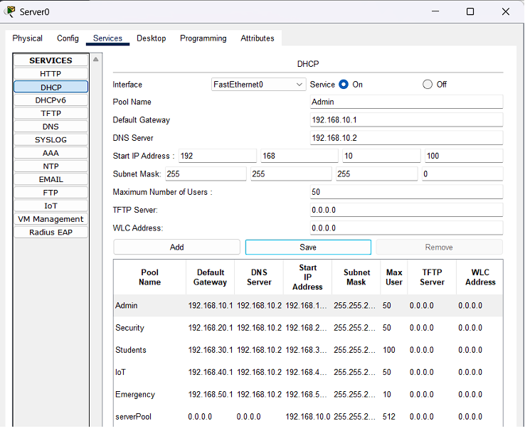
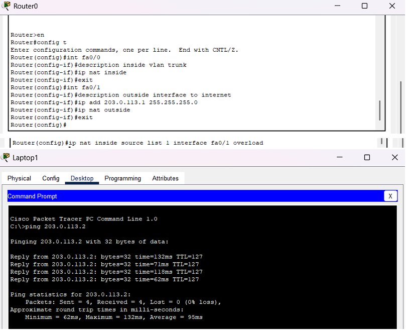
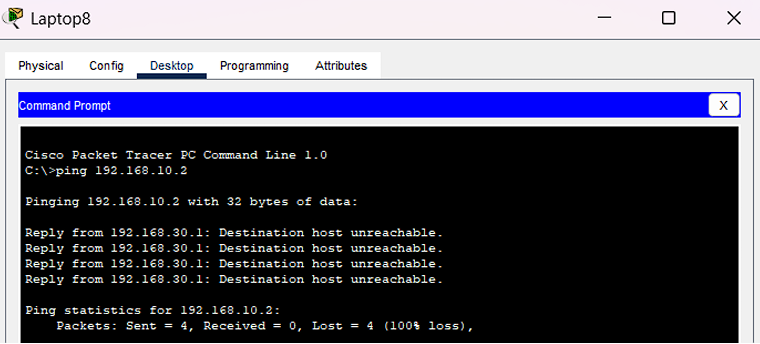

# Campus Hostel LAN

Cisco Packet Tracer network simulation for a multi-floor hostel with VLAN segmentation, inter-VLAN routing, DHCP, NAT, DNS, ACLs, wireless access, and IoT monitoring.

## Overview

This project models a secure and manageable hostel network for multiple user groups sharing the same physical infrastructure. Instead of treating the environment as a flat LAN, the design separates students, administrators, security staff, and IoT devices into different VLANs and applies routing and access controls between them.

The result is a portfolio-style networking project that demonstrates both topology planning and device-level configuration.

## Network Goals

- Separate user groups with VLANs
- Support inter-VLAN communication where appropriate
- Provide DHCP, DNS, and internet access through a central design
- Restrict unnecessary access with ACLs
- Include wireless and IoT components in the same simulation

## Architecture Summary

- Basement: admin office, security room, control devices
- First floor: student rooms with wireless access
- Second floor: student rooms with wireless access
- IoT layer: smart lock, sirens, cameras, and gateway control
- Core router and switch backbone with router-on-a-stick routing

## Key Features

| Feature | Implementation |
|---|---|
| VLAN segmentation | Separate networks for admin, security, students, IoT, and emergency systems |
| Inter-VLAN routing | 802.1Q subinterfaces on the router |
| DHCP | Centralized IP assignment per VLAN |
| NAT/PAT | Shared internet access through a public-facing router interface |
| DNS | Local name resolution for internal services |
| ACLs | Access restrictions between VLANs |
| Wireless | Room-level access points for student devices |
| IoT | Smart door lock, sirens, cameras, and browser-based control |

## VLAN Plan

| VLAN ID | Name | Purpose | Subnet |
|---|---|---|---|
| 10 | Admin | Server, admin PC, management | 192.168.10.0/24 |
| 20 | Security | CCTV monitoring and security systems | 192.168.20.0/24 |
| 30 | Students | Student laptops and phones | 192.168.30.0/24 |
| 40 | IoT | Smart devices and gateway | 192.168.40.0/24 |
| 50 | Emergency | Emergency alert systems | 192.168.50.0/24 |

## Open The Simulation

1. Clone the repository:

```bash
git clone https://github.com/imnxr/campus-hostel-lan.git
cd campus-hostel-lan
```

2. Open the Packet Tracer file at the repository root:

```text
campus_hostel_lan.pkt
```

3. Explore the supporting configuration files in `configs/`.

## Configuration Files

The repository includes readable text exports for the core network devices, so the setup can still be reviewed without opening Packet Tracer.

| File | Purpose |
|---|---|
| `configs/core_switch.txt` | VLAN creation and trunk configuration |
| `configs/basement_switch.txt` | Basement port assignments |
| `configs/floor1_switch.txt` | First-floor port configuration |
| `configs/floor2_switch.txt` | Second-floor port configuration |
| `configs/router.txt` | Router subinterfaces, NAT, and relay logic |
| `configs/dhcp_pools.txt` | DHCP pools per VLAN |
| `configs/dns_records.txt` | Local DNS mappings |
| `configs/acl_rules.txt` | Access-control logic |

## Screenshots

### Network Topology


### VLAN Configuration


### Inter-VLAN Routing


### DHCP Setup



### NAT and Connectivity



### DNS Configuration


### ACL Validation




## Why This Project Is Useful

This project shows how networking concepts translate into a realistic environment with multiple trust levels, practical service requirements, and security boundaries. 
